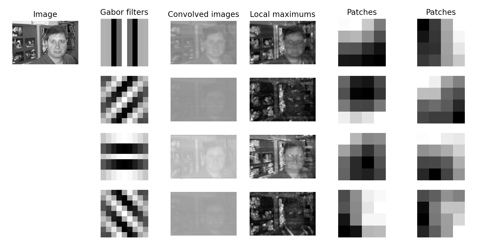

# Computational Face Recognition Model 

## About ##

This model categorizes a set of positive and negative test images as faces or non-faces, as inspired by [Riesenhuber and Poggo's HMAX model](https://www.researchgate.net/publication/12774907_Riesenhuber_M_Poggio_T_Hierarchical_models_of_object_recognition_in_cortex_Nat_Neurosci_2_1019-1025) of facial recognition in the cortex. 

The key insight of the HMAX model is to take local maximums at the second stage of processing. This produces positional invariance; that is, it allows the model to detect a face being present at any part of a local region. 

## Testing: ##

To observe processing at each stage of the model, edit `demo.py` to whatever test image is being examined. Then run: 

`python demo.py`

To train and test the model on a full set of images, edit `classify.py` with directories of positive (face) and negative (nonface) training images and positive and negative test images. It is suggested to use a similar number of training and test images for optimal results. Then run: 

`python classify.py`

The images in the project directory were from Prasun Roy's Natural Images dataset at `https://www.kaggle.com/datasets/prasunroy/natural-images` 